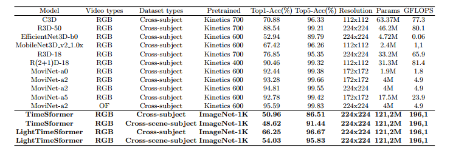

# Video Gesture Action Classification
Inspired by the official pytorch implementation of the ICML 2021 paper [Is Space-Time Attention All You Need for Video Understanding?](https://arxiv.org/pdf/2102.05095.pdf). Nowadays, TimeSformer provides an efficient video classification framework that achieves state-of-the-art results on several video action recognition benchmarks such as Kinetics-400. In this repository, I will tune the model TimeSformer with Pytorch code for training and testing a shortened version of TimeSFormer called LightTimeSFormer by optimizing some parameters in the original architecture to avoid overfitting issues. I finally validate both models on datasets MuWiGes. The experiments confirm and provide recommendations for further research on HAR with CNNs or Transformer models in the future.

# General Framework
I propose a framework for human action recognition, as illustrated in Fig.1.
It is composed of two main phases:

– Training phase takes the samples from the training set and learns the model
parameters.

– Testing phase validates the performance of the trained model with the testing set.


Our recognition model is constructed as follows: Initially, the video datasets are divided into two sets — the training set and the testing set. The original video consists of different stacked frames, and I will filter out limited significant frames through the sampling technique to be pushed into the model as input frames. Subsequently, the data is trained with a base model and a modified version of TimeSformer, resulting in recognition models that have learned important features from various activities. In the last step, I will evaluate the performance of this model on the testing set.

For both phases, I had to extract some keyframes from the video data to create a shorter clip before feeding it into the model. I call this step data sampling. I'll then apply a random sampling strategy during the training phase to vary the frames taken. For consistency, during the testing phase, for a fair comparison of different methods, I use a uniform sampling technique.

# Recognition model

In this work, I initially investigate the TimeSFormer, a transformer model which is recently introduced by Bertasius et al. and has been shown to outperform existing methods. The TimeSformer architecture is built based on the model ViT (Vision Transformer) architecture. This model extends ViT from image inputs to videos by proposing and experimenting with variations of Self-Attention schemes in both spatial and temporal dimensions in videos. The overall LightTimeSformer architecture can be seen:


**Input:** The model’s input is a short clip extracted from the original video. The video has dimensions (H, W, 3, F) along with the parameter Sampling rate. Additionally, the default frame rate per second (FPS) for all videos is set to 30. More details about these parameters are as follows:
* (H, W) represents the video resolution, and it is resized to ensure both H
and W have the same size, resulting in a square-shaped frame. ”3” is the
number of color channels (RGB). F is the number of frames in the input
short clip.
* Sampling rate is the number of consecutive frames in the original video to
select one frame. The selected frames depend on the parameter F. For example, if a video has 128 frames, F = 4, and the Sampling rate = 32, which
means that for every 32 frames, a frame will be selected until 4 frames are
chosen to form a clip.
* The default config of the model TimeSformer: 224 × 224 × 3 × 8, Sampling rate = 32. In the initial stage, videos is segmented into short clips and each frame in the clips is then divided into patches with the same size. The patches are flattened into a vector containing two kinds of information: the position of the patch in the frame and the position of the frame containing that patch in the clip - This process serves as the Positional Embedding of the input to the Transformers network, enabling the Self-Attention mechanism to capture the positions of components in
the sequence. Subsequently, the vectors enter the Encoder block, passing through layers such as normalization (Norm), Multi-head attention (including Temporal Attention and Spatial Attention, which have 12 ”head” for each block), combined with residual connection methods, and then through a Multi-Layer Perceptron (MLP) layer. The output becomes the input to the next Encoder block, and after passing through 12 times in Encoder blocks,

**Output:** A probability vector corresponding to the number of classes in the given tasks.

**LightTimeSformer:**
I will propose a variation of TimeSformer called LightTimeSformer in an attempt to adapt the model with short gesture datasets. the parameters are also modified to make LightTimeSformer optimized on the experimented datasets. Several major details of LightTimeSFormer’s configuration are as follows:

 


# Dataset

MuWiGes datasets: The research team of the AFOSR project from the paper [Hand Gesture Recognition From Wrist-Worn Camera for Human–Machine Interaction](https://ieeexplore.ieee.org/stamp/stamp.jsp?tp=&arnumber=10135101) designed a device equipped with a camera, worn on the wrist like a smartwatch. The camera is set up to focus on the hand during gesture performance. During data collection, volunteers will wear the device in an environment with sufficient lighting conditions. 


The collected dataset consists of 5,408 RGB video samples of 12 gestures performed by 50 participants, including 30 males and 20 females. The dataset features diversity in backgrounds, viewpoints, and participants. After collecting the dataset, the research team assigned labels to the 12 gestures, corresponding to the numbers from G1 to G12.


Given the dataset's diversity in backgrounds and participants, the training and testing sets were divided in two ways to perform a comprehensive evaluation:

* **Cross Subject:** The training set includes data from 35 participants with 3,636 samples, and the testing set consists of data from the remaining 15 participants with 1,772 samples.

* **Cross Scene_Subject:** The testing set includes data from 15 participants collected in the same environment, comprising 1,775 samples. The training set includes data from the remaining 35 participants, with 3,633 samples.

## Experimental results

I conducted experiments on two models TimeSformer and LightTimeSformer. In the training phase, the loss function of both models gradually decrease across epochs. As illustrated in the following picture , it is evident that the Loss function of LightTimeSformer shows signs of earlier convergence and slightly lower than that of TimeSformer. 


The accuracy of each gesture in the testing process can be seen in next pitucre. With TimeSformer, gestures G2 and G5 achieved the highest accuracies while the remaining gestures have lower accuracy and are more easily to be mispredicted. In contrast, LightTimeSformer shows significant improvements for gestures G1 and G2, achieving high accuracy levels between 80-95%. Gestures from G8 to G12 also gain much higher accuracy. A few gestures have their accuracy moderately dropped such as G5, G6 and G7. Only gesture G6 in cross-scene-subject is significantly mispredicted. The reason is that the more accurate gestures are likely to have the stark differences of trajectories whereas the less accurate gestures have the similar trajectories that confuse the model. Therefore, I can enhance the dataset by constructing gestures with more distinct motion trajectories to improve overall performance. In conclusion, LightTimeSformer has significantly improved the accuracy of certain gestures and reduce overfitting problem, resulting in a more consistent recognition gestures model.



| Model | Video Types | Datasets Type | Pretrained | acc@1 | acc@5 | Resolution | Params | GFLOPs |
| --- | --- | --- | --- | --- | --- | --- | --- | --- | 
| C3D | RGB | Cross-subject | Kinetics 700 | 70.88 | 96.33| 112x112 | 63.37M | 77.3 |
| R3D-50 | RGB | Cross-subject | Kinetics 700 | 88.54 | 99.21| 224x224 | 46.2M | 80.1 |
| EfficentNet3D-b0 | RGB | Cross-subject | Kinetics 600 | 52.94 | 89.79 | 224x224 | 4.72M | 0.06 |
| MobileNet3D_v2_1.0x| RGB | Cross-subject | Kinetics 600 | 67.42 | 96.26| 112x112 | 2.4M | 1,1 |
| R3D-18 | RGB | Cross-subject | Kinetics 700 | 76.85| 95.35 | 224x224 | 33.2M | 65.9 |
| MoviNet-a0 | RGB | Cross-subject | Kinetics 600 | 92.44 | 99.38| 172x172 | 1.9M | 1.8 |
| MoviNet-a2 | RGB | Cross-subject | Kinetics 600 | 93.28 | 99.66| 172x172 | 4M | 4.9 |
| MoviNet-a2 | RGB | Cross-subject | Kinetics 600 | 94.81 | 99.55| 224x224 | 4M | 4.9 |
| MoviNet-a5 | RGB | Cross-subject | Kinetics 600 | 92.78 | 99.42| 172x172 | 17.5M | 23.9 |
| MoviNet-a2 | OF | Cross-subject | Kinetics 600 | 95.59 | 99.83| 224x224 | 4M | 4.9 |
| --- | --- | --- | --- | --- | --- | --- | --- | --- | 
| TimeSformer | RGB | Cross-subject | ImageNet-1K | 50.96 | 86.51| 224x224 | 121.2M | 196.1 |
| TimeSformer | RGB | Cross-scene-subject | ImageNet-1K | 48.52 | 91.44| 224x224 | 121.2M | 196.1 |
| **LightTimeSformer** | **RGB** | **Cross-subject** | **ImageNet-1K** | **66.25** | **96.67**| **224x224** | **121.2M** | **196.1** |
| **LightTimeSformer** | **RGB** | **Cross-scene-subject** | **ImageNet-1K** | **54.03** | **95.83**| **224x224** | **121.2M** | **196.1** |

In addition, I conduct a performance comparison of TimeSformer with other CNN models on the MuWiGes dataset in the paper [Hand Gesture Recognition From Wrist-Worn Camera for Human–Machine Interaction](https://ieeexplore.ieee.org/stamp/stamp.jsp?tp=&arnumber=10135101). Compared to the TimeSformer model, the LightTimeSformer model has shown an improvement in performance by approximately 16% with cross-subject type, with a Top1-Accuracy of 66.25% and Top5-Accuracy of 96.67%. Meanwhile, with cross-scene-subject type, the LightTimeSformer model witnessed an increase in model performance of about 6%, achieving a Top1-Accuracy of 54.03% and a Top-5-Accuracy of 95.83%. 

In addition, Top5-Accuracy is always higher than or equal to Top1-Accuracy as it can make more predictions with a higher probability of being correct. Moreover, the MuWiGes dataset has a limited number of labels, with only 12 labels, while other large-scale datasets may have thousands of labels. Thus, although Top5-Accuracy achieved a higher value than Top1-Accuracy, Top1-Accuracy is much more crucial in the case of this dataset. In conclusion, these results are not yet promising for practical applications, as they still fall short compared to simpler 3D CNN models, which can achieve around 90% performance on the MuWiGes dataset. One can conclude that for smaller datasets like MuWiGes, TimeSformer doesn’t yield the best performance.


# Reference: TimeSformer
If you find TimeSformer useful in your research, please use the following BibTeX entry for citation.
```BibTeX
@inproceedings{gberta_2021_ICML,
    author  = {Gedas Bertasius and Heng Wang and Lorenzo Torresani},
    title = {Is Space-Time Attention All You Need for Video Understanding?},
    booktitle   = {Proceedings of the International Conference on Machine Learning (ICML)}, 
    month = {July},
    year = {2021}
}
```
# Model Zoo

Provide TimeSformer models pretrained on Kinetics-400 (K400), Kinetics-600 (K600), Something-Something-V2 (SSv2), and HowTo100M datasets.

| name | dataset | # of frames | spatial crop | acc@1 | acc@5 | url |
| --- | --- | --- | --- | --- | --- | --- |
| TimeSformer | K400 | 8 | 224 | 77.9 | 93.2 | [model](https://www.dropbox.com/s/g5t24we9gl5yk88/TimeSformer_divST_8x32_224_K400.pyth?dl=0) |
| TimeSformer-HR | K400 | 16 | 448 | 79.6 | 94.0 | [model](https://www.dropbox.com/s/6f0x172lpqy3oxt/TimeSformer_divST_16x16_448_K400.pyth?dl=0) |
| TimeSformer-L | K400 | 96 | 224 | 80.6 | 94.7 | [model](https://www.dropbox.com/s/r1iuxahif3sgimo/TimeSformer_divST_96x4_224_K400.pyth?dl=0) |

| name | dataset | # of frames | spatial crop | acc@1 | acc@5 | url |
| --- | --- | --- | --- | --- | --- | --- |
| TimeSformer | K600 | 8 | 224 | 79.1 | 94.4 | [model](https://www.dropbox.com/s/4h2qt41m2z3aqrb/TimeSformer_divST_8x32_224_K600.pyth?dl=0) |
| TimeSformer-HR | K600 | 16 | 448 | 81.8 | 95.8 | [model](https://www.dropbox.com/s/ft1e92g2vhvxecv/TimeSformer_divST_16x16_448_K600.pyth?dl=0) |
| TimeSformer-L | K600 | 96 | 224 | 82.2 | 95.6 | [model](https://www.dropbox.com/s/857rx6xeclxfhdg/TimeSformer_divST_96x4_224_K600.pyth?dl=0) |

| name | dataset | # of frames | spatial crop | acc@1 | acc@5 | url |
| --- | --- | --- | --- | --- | --- | --- |
| TimeSformer | SSv2 | 8 | 224 | 59.1 | 85.6 | [model](https://www.dropbox.com/s/tybhuml57y24wpm/TimeSformer_divST_8_224_SSv2.pyth?dl=0) |
| TimeSformer-HR | SSv2 | 16 | 448 | 61.8 | 86.9 | [model](https://www.dropbox.com/s/9t68uzk8w2fpfnv/TimeSformer_divST_16_448_SSv2.pyth?dl=0) |
| TimeSformer-L | SSv2 | 64 | 224 | 62.0 | 87.5 | [model](https://www.dropbox.com/s/3f1rm2al8mhprwa/TimeSformer_divST_64_224_SSv2.pyth?dl=0) |

| name | dataset | # of frames | spatial crop | single clip coverage | acc@1 | url |
| --- | --- | --- | --- | --- | --- | --- |
| TimeSformer | HowTo100M | 8 | 224 | 8.5s | 56.8 | [model](https://www.dropbox.com/s/9v8hcm88b9tc6ff/TimeSformer_divST_8x32_224_HowTo100M.pyth?dl=0) |
| TimeSformer | HowTo100M | 32 | 224 | 34.1s | 61.2 | [model](https://www.dropbox.com/s/4roflx4q1gscu85/TimeSformer_divST_32x32_224_HowTo100M.pyth?dl=0) |
| TimeSformer | HowTo100M | 64 | 448 | 68.3s | 62.2 | [model](https://www.dropbox.com/s/15bvqltl1j5vyp3/TimeSformer_divST_64x32_224_HowTo100M.pyth?dl=0) |
| TimeSformer | HowTo100M | 96 | 224 | 102.4s | 62.6 | [model](https://www.dropbox.com/s/t2mzgahnfhgakma/TimeSformer_divST_96x32_224_HowTo100M.pyth?dl=0) |

We note that these models were re-trained using a slightly different implementation than the one used in the paper. Therefore, there might be a small difference in performance compared to the results reported in the paper.

You can load the pretrained models as follows:

```python
import torch
from timesformer.models.vit import TimeSformer

model = TimeSformer(img_size=224, num_classes=400, num_frames=8, attention_type='divided_space_time',  pretrained_model='/path/to/pretrained/model.pyth')

dummy_video = torch.randn(2, 3, 8, 224, 224) # (batch x channels x frames x height x width)

pred = model(dummy_video,) # (2, 400)
```

# Installation

First, create a conda virtual environment and activate it:
```
conda create -n timesformer python=3.7 -y
source activate timesformer
```
Or using python >= 3.7 with vitrual-env
```
sudo apt-get install python3-env
python3 -m venv env
```

Then, install the following packages:

- torchvision: `pip install torchvision` or `conda install torchvision -c pytorch`, must install torch <= 1.9.0
- [fvcore](https://github.com/facebookresearch/fvcore/): `pip install 'git+https://github.com/facebookresearch/fvcore'`
- simplejson: `pip install simplejson`
- einops: `pip install einops`
- timm: `pip install timm`
- PyAV: `conda install av -c conda-forge` or `pip install av`
- psutil: `pip install psutil`
- scikit-learn: `pip install scikit-learn`
- OpenCV: `pip install opencv-python`
- tensorboard: `pip install tensorboard`

Lastly, build the TimeSformer codebase by running:
```
git clone https://github.com/facebookresearch/TimeSformer
cd TimeSformer
python setup.py build develop
```

# Usage

## Dataset Preparation

Please use the dataset preparation instructions provided in [DATASET.md](timesformer/datasets/DATASET.md).

## Training the Default TimeSformer

Training the default TimeSformer that uses divided space-time attention, and operates on 8-frame clips cropped at 224x224 spatial resolution, can be done using the following command:

```
python tools/run_net.py \
  --cfg configs/Kinetics/vn.yaml \
  NUM_GPUS 1 \
  TRAIN.BATCH_SIZE 4 \
```
You may need to pass location of your dataset in the command line by adding `DATA.PATH_TO_DATA_DIR path_to_your_dataset`, or you can simply add

```
DATA:
  PATH_TO_DATA_DIR: path_to_your_dataset
```

To the yaml configs file, then you do not need to pass it to the command line every time.

## Using a Different Number of GPUs

If you want to use a smaller number of GPUs, you need to modify .yaml configuration files in [`configs/`](configs/). Specifically, you need to modify the NUM_GPUS, TRAIN.BATCH_SIZE, TEST.BATCH_SIZE, DATA_LOADER.NUM_WORKERS entries in each configuration file. The BATCH_SIZE entry should be the same or higher as the NUM_GPUS entry. In [`configs/Kinetics/TimeSformer_divST_8x32_224_4gpus.yaml`](configs/Kinetics/TimeSformer_divST_8x32_224_4gpus.yaml), we provide a sample configuration file for a 4 GPU setup.


## Using Different Self-Attention Schemes

If you want to experiment with different space-time self-attention schemes, e.g., space-only or joint space-time attention, use the following commands:


```
python tools/run_net.py \
  --cfg configs/Kinetics/TimeSformer_spaceOnly_8x32_224.yaml \
  DATA.PATH_TO_DATA_DIR path_to_your_dataset \
  NUM_GPUS 8 \
  TRAIN.BATCH_SIZE 8 \
```

and

```
python tools/run_net.py \
  --cfg configs/Kinetics/TimeSformer_jointST_8x32_224.yaml \
  DATA.PATH_TO_DATA_DIR path_to_your_dataset \
  NUM_GPUS 8 \
  TRAIN.BATCH_SIZE 8 \
```

## Training Different TimeSformer Variants

If you want to train more powerful TimeSformer variants, e.g., TimeSformer-HR (operating on 16-frame clips sampled at 448x448 spatial resolution), and TimeSformer-L (operating on 96-frame clips sampled at 224x224 spatial resolution), use the following commands:

```
python tools/run_net.py \
  --cfg configs/Kinetics/TimeSformer_divST_16x16_448.yaml \
  DATA.PATH_TO_DATA_DIR path_to_your_dataset \
  NUM_GPUS 8 \
  TRAIN.BATCH_SIZE 8 \
```

and

```
python tools/run_net.py \
  --cfg configs/Kinetics/TimeSformer_divST_96x4_224.yaml \
  DATA.PATH_TO_DATA_DIR path_to_your_dataset \
  NUM_GPUS 8 \
  TRAIN.BATCH_SIZE 8 \
```

Note that for these models you will need a set of GPUs with ~32GB of memory.

## Inference

Use `TRAIN.ENABLE` and `TEST.ENABLE` to control whether training or testing is required for a given run. When testing, you also have to provide the path to the checkpoint model via TEST.CHECKPOINT_FILE_PATH.
```
python tools/run_net.py \
  --cfg configs/Kinetics/TimeSformer_divST_8x32_224_TEST.yaml \
  DATA.PATH_TO_DATA_DIR path_to_your_dataset \
  TEST.CHECKPOINT_FILE_PATH path_to_your_checkpoint \
  TRAIN.ENABLE False \
```

## Single-Node Training via Slurm

To train TimeSformer via Slurm, please check out our single node Slurm training script [`slurm_scripts/run_single_node_job.sh`](slurm_scripts/run_single_node_job.sh).


## Multi-Node Training via Submitit

Distributed training is available via Slurm and submitit

```
pip install submitit
```

To train TimeSformer model on Kinetics using 4 nodes with 8 gpus each use the following command:
```
python tools/submit.py --cfg configs/Kinetics/TimeSformer_divST_8x32_224.yaml --job_dir  /your/job/dir/${JOB_NAME}/ --num_shards 4 --name ${JOB_NAME} --use_volta32
```

We provide a script for launching slurm jobs in [`slurm_scripts/run_multi_node_job.sh`](slurm_scripts/run_multi_node_job.sh).

## Finetuning

To finetune from an existing PyTorch checkpoint add the following line in the command line, or you can also add it in the YAML config:

```
TRAIN.CHECKPOINT_FILE_PATH path_to_your_PyTorch_checkpoint
TRAIN.FINETUNE True
```

## HowTo100M Dataset Split

If you want to experiment with the long-term video modeling task on HowTo100M, please download the train/test split files from [here](https://www.dropbox.com/sh/ttvsxwqypijjuda/AACmJx1CnddW6cVBoc21eSuva?dl=0).


# Environment

The code was developed using python 3.7 on Ubuntu 20.04. For training, we used four GPU compute nodes each node containing 8 Tesla V100 GPUs (32 GPUs in total). Other platforms or GPU cards have not been fully tested.

# License

The majority of this work is licensed under [CC-NC 4.0 International license](LICENSE). However portions of the project are available under separate license terms: [SlowFast](https://github.com/facebookresearch/SlowFast) and [pytorch-image-models](https://github.com/rwightman/pytorch-image-models) are licensed under the Apache 2.0 license.

# Contributing

We actively welcome your pull requests. Please see [CONTRIBUTING.md](CONTRIBUTING.md) and [CODE_OF_CONDUCT.md](CODE_OF_CONDUCT.md) for more info.

# Acknowledgements

TimeSformer is built on top of [PySlowFast](https://github.com/facebookresearch/SlowFast) and [pytorch-image-models](https://github.com/rwightman/pytorch-image-models) by [Ross Wightman](https://github.com/rwightman). We thank the authors for releasing their code. If you use our model, please consider citing these works as well:

```BibTeX
@misc{fan2020pyslowfast,
  author =       {Haoqi Fan and Yanghao Li and Bo Xiong and Wan-Yen Lo and
                  Christoph Feichtenhofer},
  title =        {PySlowFast},
  howpublished = {\url{https://github.com/facebookresearch/slowfast}},
  year =         {2020}
}
```

```BibTeX
@misc{rw2019timm,
  author = {Ross Wightman},
  title = {PyTorch Image Models},
  year = {2019},
  publisher = {GitHub},
  journal = {GitHub repository},
  doi = {10.5281/zenodo.4414861},
  howpublished = {\url{https://github.com/rwightman/pytorch-image-models}}
}
```
